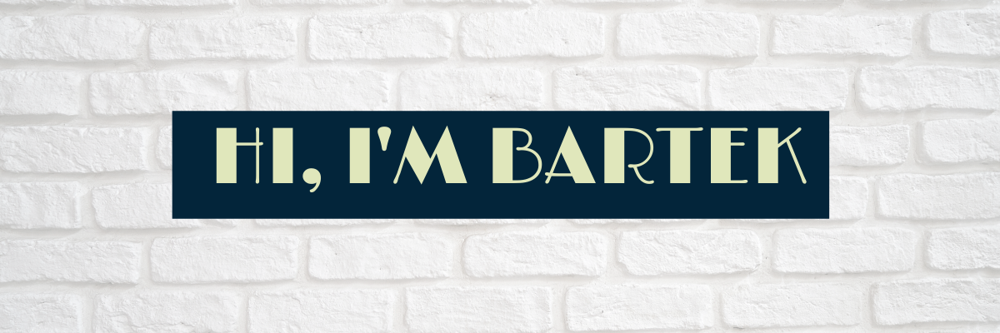

  <h3>
    <a href="#about">About</a>
     | 
    <a href="#languages">Languages</a>
     | 
    <a href="#technologies">Technologies</a>
     | 
    <a href="#stats">Stats</a>
     | 
    <a href="#projects">Projects</a>
     | 
    <a href="mailto:bartosz.zbytniewski.dev@gmail.com" alt="Contact me">Contact</a>
  </h3>

## 
About me

I love making things. I'm fascinated by programming because I can make my own tools which do exactly
what I want.

<table>
  <tr>
    <td align="left"><b>🐧 Heavy Linux user 🍕 Using Vim anywhere I can ⁙ Focusing on making SOLID, well tested software</b></td>
    <td align="left"><b>☛ Quick learner 🦀 Writing software in <a href="https://www.rust-lang.org/">Rust</a> in my free time <b></td>
  </tr>
</table>

  
Experience

  - over 5 years of commercial experience in Java
  - working on multiple projects in international teams for big clients (worldwide, known brands)
  - technical interviewer of Java devs for over 3 years
  - technical interviewer of React devs

### 
Languages

##### Most comfortable with

  
  
  

##### Comfortable with

  
  
  
  

## 
Technologies

  
  
  
  
  
  
  
  
  
  

## 
Stats

  

  

## 
My projects

> Talk is cheap. Show me the code.

― Linus Torvalds

....

....

....

